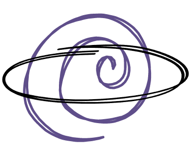
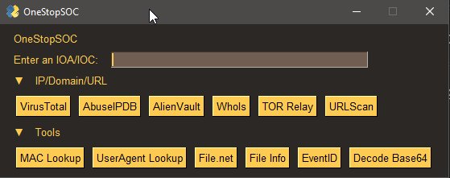

<!-- PROJECT SHIELDS -->
[![Contributors][contributors-shield]][contributors-url]
[![Forks][forks-shield]][forks-url]
[![Stargazers][stars-shield]][stars-url]
[![License][license-shield]][license-url]


<!-- PROJECT LOGO -->
<br />
<h3 align="center">OneStopSOC</h3>
<p align="center">
  <a href="https://github.com/AlbusNoir/OneStopSOC" align="center">
    
  </a>
  <br />
  OneStopSOC is a collection of tools typically used by SOC analysts when triaging alerts presented in a python GUI. 
</p>


<!-- TABLE OF CONTENTS -->
<details open="open">
  <summary><h2 style="display: inline-block">Table of Contents</h2></summary>
  <ol>
    <li>
      <a href="#about-the-project">About The Project</a>
      <ul>
        <li><a href="#languages-and-frameworks">Languages and Frameworks</a></li>
      </ul>
    </li>
    <li>
      <a href="#getting-started">Getting Started</a>
      <ul>
        <li><a href="#prerequisites">Prerequisites</a></li>
        <li><a href="#installation">Installation</a></li>
      </ul>
    </li>
    <li><a href="#usage">Usage</a></li>
    <li><a href="#roadmap">Roadmap</a></li>
    <li><a href="#contributing">Contributing</a></li>
    <li><a href="#license">License</a></li>
    <li><a href="#contact">Contact</a></li>
    <li><a href="#acknowledgements">Acknowledgements</a></li>
  </ol>
</details>


<!-- ABOUT THE PROJECT -->
## About The Project




### Languages and Frameworks

* Python 3.11


<!-- GETTING STARTED -->
## Getting Started

### Prerequisites
* None

### Installation

1. Clone the repo
   ```
   git clone https://github.com/AlbusNoir/OneStopSOC.git
   ```
2. Install requirements
   ```
   pip install -r requirements.txt
   ```


<!-- USAGE EXAMPLES -->
## Usage

The project currently features the following tools:
- AbuseIPDB
- Base64 Decode with CyberChef
- VirusTotal
- AlienVault domain lookup
- WhoIs domain lookup
- TOR relay lookup
- URLScan.io lookup
- MAC Address lookup
- UserAgent lookup
- File.net lookup
- File info for file extensions
- EventID lookup


<!-- ROADMAP -->
## Roadmap
_Current_
- [x] Tools listed above 

_Future Plans_
- [ ] Additional tools
- [ ] Additional features??


<!-- CONTRIBUTING -->
## Contributing

If you want to make contributions:

1. Fork this Repository
2. Create your Branch(`git checkout -b <branch name>`)
3. Commit your Changes(`git commit -m 'I did some things'`)
4. Push to the Branch(`git push origin <project_name>/<location>`)
5. Open a Pull Request

Feel free to contribute to this project if it interests you.

<!-- LICENSE -->
## License

Distributed under the MIT License. See [`LICENSE INFO`](https://choosealicense.com/licenses/mit/) for more information.


<!-- CONTACT -->
## Contact

|  Name | Social | Email |
|-------| ------------- | ------------- |
| Name  | [![Twitter][twitter-shield]][twitter-url] | <a href="mailto:kalegithub@gmail.com"></a>|


<!-- ACKNOWLEDGEMENTS -->
## Acknowledgements & Contributions

#### Thank you to the following:

| User                                      | Contribution |
|-------------------------------------------| ------------- |
| [@AlbusNoir](https://github.com/{user})  | Project |
|  [@zdhenard42](https://github.com/{user}) | Original idea via his project [SOC-Multitool](https://github.com/zdhenard42/SOC-Multitool) |


<!-- MARKDOWN LINKS & IMAGES -->
<!-- https://www.markdownguide.org/basic-syntax/#reference-style-links -->
[contributors-shield]: https://img.shields.io/github/contributors/AlbusNoir/OneStopSOC.svg?style=for-the-badge
[contributors-url]: https://github.com/AlbusNoir/OneStopSOC/graphs/contributors
[forks-shield]: https://img.shields.io/github/forks/AlbusNoir/OneStopSOC.svg?style=for-the-badge
[forks-url]: https://github.com/AlbusNoir/OneStopSOC/network/members
[stars-shield]: https://img.shields.io/github/stars/AlbusNoir/OneStopSOC.svg?style=for-the-badge
[stars-url]: https://github.com/AlbusNoir/OneStopSOC/stargazers
[license-shield]: https://img.shields.io/github/license/AlbusNoir/OneStopSOC.svg?style=for-the-badge
[license-url]: https://github.com/AlbusNoir/OneStopSOC/blob/master/LICENSE
[twitter-shield]: https://img.shields.io/badge/-twitter-Twitter?style=for-the-badge&logo=twitter&colorB=555
[twitter-url]: https://twitter.com/kaleleafygreen
